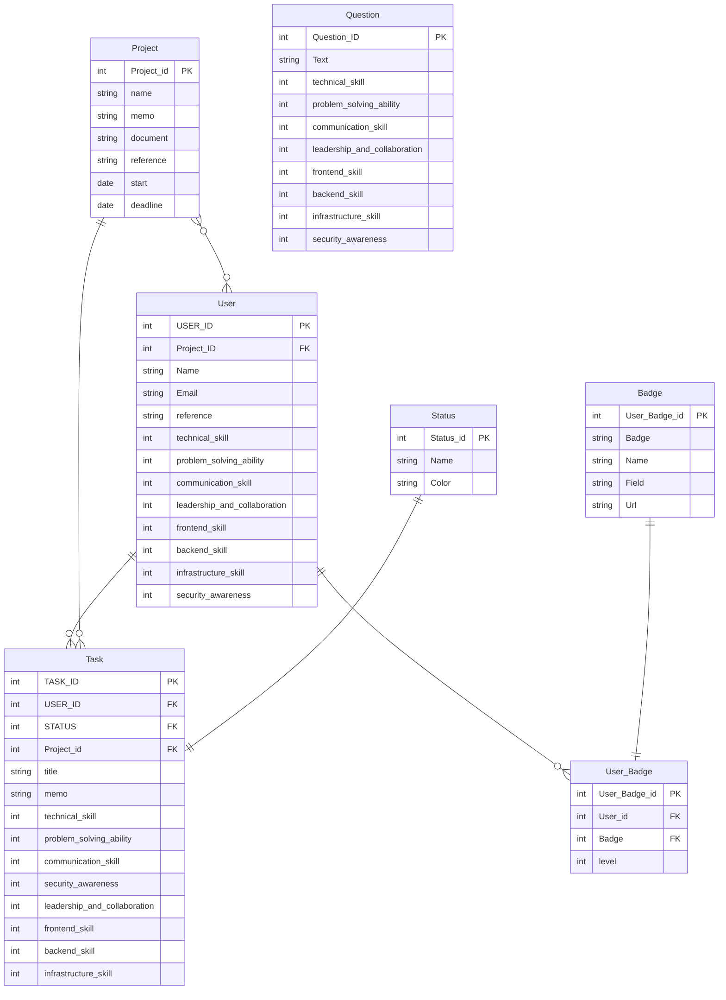

# setup

```sh
docker-compose up --build -d
# --build オプションをつけることで、変更があった場合にイメージを再ビルド
docker-compose down
```

```sh
docker build -t fastapi-app .
docker run -d -p 8000:8000 fastapi-app


docker exec -it fastapi-app /bin/sh
```


